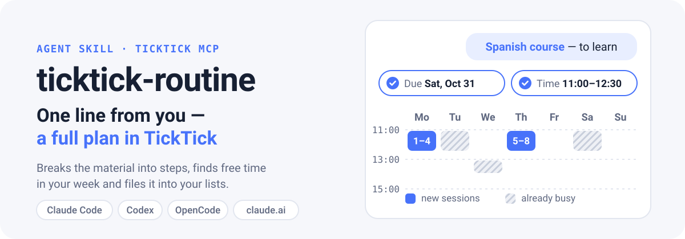
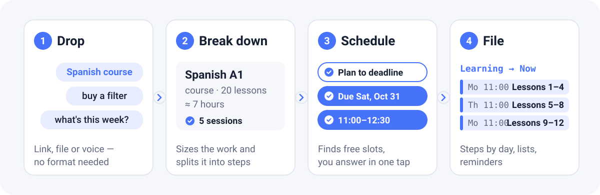
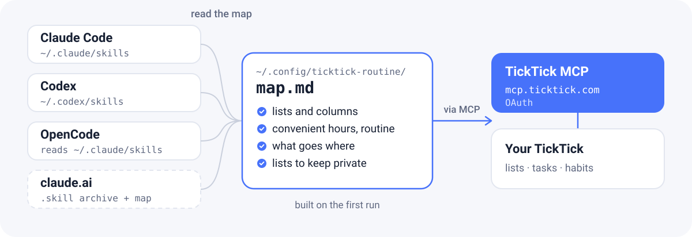

<p align="center">
  <a href="README.md"></a>
  <a href="README.ru.md"></a>
</p>

<p align="center">
  
</p>

<p align="center">
  
  
  
  
  
</p>

**ticktick-routine** is an AI-agent skill that sorts out whatever you throw at it: useful links, courses, articles, videos, books, chores, things to buy. It asks what to do with each item, by when and at what time it suits you, looks at what your week already holds, and files the tasks into your TickTick lists as time blocks.

It works in **Claude Code**, **Codex**, **OpenCode** and **claude.ai** chat, through the official TickTick MCP.

## What it looks like

You send your agent one line:

> found an sql course https://sqlbolt.com/ want to go through it, it's for learning

The skill opens the link, finds an old «SQL» card in your TickTick and asks:

```text
🔗 SQLBolt — interactive SQL course: 18 lessons + 2 extra topics, ~4–5 h. Looks like learning.
There is already an «SQL» card in Learning → Queue — I'll make the course its plan instead of a new task.

1. What to do?   Plan to a deadline (Recommended) · One task · Queue it · Skip
2. Deadline?     By Sun Oct 18 · By Sun Oct 11 · By Sat Oct 31 · No deadline
3. What time?    11:00–12:30 (study window) · 13:00–14:30 · Evening 20:00 · No fixed time
```

You answer “plan, end of October, daytime from 11”, and it shows the plan before creating anything:

| When | What |
|---|---|
| Mon Oct 12, 11:00–12:30 | Intro + lessons 1–4: SELECT, WHERE, sorting |
| Thu Oct 15, 11:00–12:30 | Lessons 5–8: JOIN, OUTER JOIN, NULL |
| Mon Oct 19, 11:00–12:30 | Lessons 9–12: expressions, aggregates, GROUP BY |
| Thu Oct 22, 11:00–12:30 | Lessons 13–18: INSERT, UPDATE, DELETE, tables |
| Mon Oct 26, 11:00–12:30 | Subqueries, UNION and review |

A Python plan already runs until Oct 11, so SQL starts after it, and Oct 27–31 is kept as a buffer. After “yes” you get a task with the deadline and five subtasks with reminders.

<sub>The example comes from a test run on a real account with TickTick writes disabled (translated here; the skill replies in your language). In the same tests (4 scenarios) the skill passed 41 of 41 checks; the same agent without it passed 35 of 41 — it did not know the convenient hours, the confirmation rule or which list things belong in.</sub>

## What it does

- **Takes anything** — a link, a file, a screenshot, dictated text. Several things in one message go to different lists: “pay the internet bill, buy a filter, book the dentist” → home, shopping, health.
- **Asks briefly** — 1–3 questions with ready-made options, the recommended one first. Anything you already said is not asked again.
- **Plans in time blocks** — splits material by chapters, works around busy hours, recurring tasks and other study plans, keeps study under ~3 hours a day.
- **Avoids duplicates** — searches TickTick for the link and topic before creating anything.
- **Writes in your style** — lists, columns, tags and title format come from your own account.
- **Runs the routine** — “what's on my week?”, “didn't make it — reschedule”, a weekly review with results and leftovers.
- **Keeps secrets out** — lists that hold passwords are read by titles only and left out of schedule queries.

## How it works

<p align="center">
  
</p>

The skill is a set of agent instructions (`SKILL.md`) plus a map of your account. All TickTick access goes through the official MCP server `https://mcp.ticktick.com/`, where you sign in with your TickTick account. The skill stores no passwords or tokens.

## Install

Three steps: install the skill → connect TickTick → first run.

### 1. Install the skill

**One command for every agent** (needs Node.js):

```bash
npx skills add phloya/ticktick-routine -g -a claude-code -a codex -a opencode
```

**Or with the script from the repository:**

```bash
git clone https://github.com/phloya/ticktick-routine.git
```

```bash
cd ticktick-routine && ./install.sh
```

`install.sh` finds Claude Code, Codex and OpenCode on its own. Flags: `--claude`, `--codex`, `--opencode`, `--claude-ai`, `--uninstall`.

**In Claude Code, as a plugin:**

```text
/plugin marketplace add phloya/ticktick-routine
/plugin install ticktick-routine@ticktick-routine
```

### 2. Connect TickTick

Use the official server `https://mcp.ticktick.com/`. You sign in with your TickTick account in the browser; no keys to copy.

<details>
<summary><b>Claude Code</b></summary>

If TickTick is already connected as a claude.ai connector (Settings → Connectors), Claude Code picks it up by itself. Otherwise:

```bash
claude mcp add --transport http --scope user ticktick https://mcp.ticktick.com/
```

Then inside Claude Code: `/mcp` → `ticktick` → sign in.

</details>

<details>
<summary><b>Codex</b></summary>

```bash
codex mcp add ticktick --url https://mcp.ticktick.com/
```

```bash
codex mcp login ticktick
```

The skill triggers on its own; to call it explicitly, use `$ticktick-routine`. Its card and the TickTick MCP dependency are declared in `agents/openai.yaml`.

</details>

<details>
<summary><b>OpenCode</b></summary>

```bash
opencode mcp add ticktick --url https://mcp.ticktick.com/
```

```bash
opencode mcp auth ticktick
```

OpenCode looks for skills in `~/.config/opencode/skills`, and also in `~/.claude/skills` and `~/.agents/skills`. If the skill is already installed for Claude Code, you don't need a second copy.

</details>

<details>
<summary><b>claude.ai — web and mobile</b></summary>

Connect the TickTick connector in claude.ai (Settings → Connectors). Then build the skill archive together with your map:

```bash
./install.sh --claude-ai
```

Upload `dist/ticktick-routine.skill` in claude.ai: Settings → Capabilities → Skills. The archive contains your map, so don't publish it. Without a map the skill still works — it runs the setup right in the chat.

</details>

### 3. First run

Just send your agent any link. The skill sees there is no map yet and:

1. reads your lists, columns, tags and habits — read-only;
2. asks 3–4 questions: your routine, when studying is easiest, whether to preview plans before creating them, which lists to stay out of;
3. saves the map to `~/.config/ticktick-routine/map.md`.

After that it just works. To redo it, say “reconfigure the skill” or “I have new lists”.

## One map for every agent

<p align="center">
  
</p>

The map is plain Markdown: lists and their IDs, columns, convenient time windows, filing rules, private lists. Edit it by hand or tell the agent “remember that I study better in the evening”. It lives outside the skill folder, so updates never touch it and every agent on the machine sees the same one. See [ticktick-map.example.md](skills/ticktick-routine/references/ticktick-map.example.md) for the format.

## What to say

| You write | What happens |
|---|---|
| a bare link | sorting: what it is, where it goes, when to do it |
| “to learn”, “make a plan” + material | a time-blocked study plan up to the deadline |
| “useful” + a link | a bookmark in the right column, no duplicates |
| “chores: pay the internet bill by the 10th” | a task with a date, a time and optional repeat |
| “buy …” | goes to the shopping list |
| “what's on tomorrow / this week?” | an overview with free windows |
| “didn't make it”, “reschedule” | the plan is rebuilt up to the deadline |
| “weekly review” | results, leftovers, next week's plan |

Voice dictation is fine: misheard spellings of TickTick are understood.

## Safety and limits

- Writes to TickTick only after you answer; a multi-task plan only after “yes”. Deletes only when you explicitly ask.
- Lists with secrets (for example, bookmarks with passwords) are read by titles only and left out of schedule queries.
- Busy time comes from TickTick and the map. Google Calendar and other calendars are not considered.
- TickTick returns only the next occurrence of a recurring task; the skill works out the following ones itself.
- The skill's instructions are written in Russian; it replies in the user's language.

## Repository layout

```text
skills/ticktick-routine/
├── SKILL.md                      main workflow
├── agents/openai.yaml            Codex card and MCP dependency
├── references/
│   ├── setup.md                  first run: account map
│   ├── ticktick-map.example.md   map template
│   ├── ticktick-api.md           TickTick MCP cheat sheet
│   └── routines.md               overview, rescheduling, weekly review
└── scripts/days.py               calendar with weekday names
install.sh                        installer for Claude Code, Codex, OpenCode, claude.ai
.claude-plugin/                   Claude Code plugin and marketplace
assets/readme/                    illustrations (source: source/build_svgs.py)
```

## Update or remove

```bash
npx skills update ticktick-routine
```

Or `git pull && ./install.sh`. To remove: `./install.sh --uninstall` or `npx skills remove ticktick-routine`. The map in `~/.config/ticktick-routine/` stays; delete it by hand if you no longer need it.

## License

[MIT](LICENSE)
