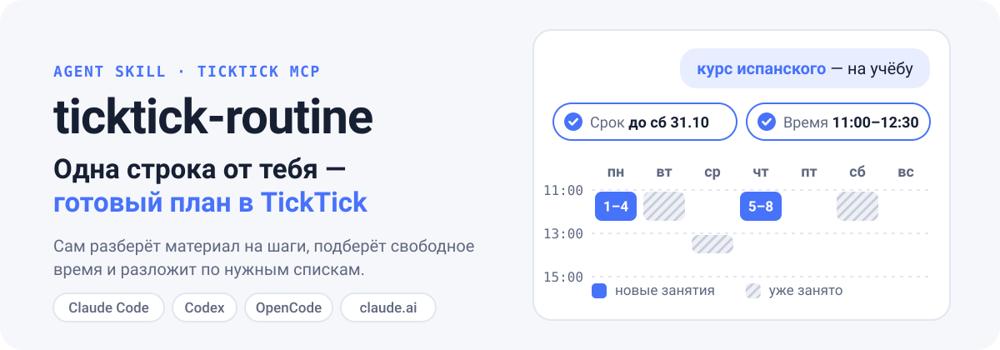
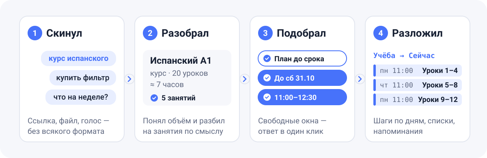
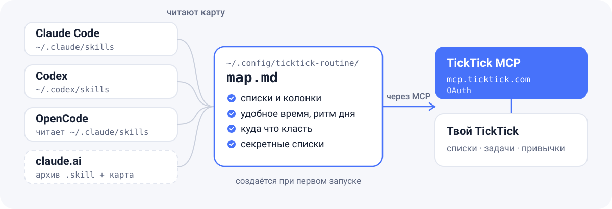

<p align="center">
  <a href="README.md"></a>
  <a href="README.ru.md"></a>
</p>

<p align="center">
  
</p>

<p align="center">
  
  
  
  
  
</p>

**ticktick-routine** — скилл для AI-агента, который разбирает всё, что ты ему кидаешь: полезные ссылки, курсы, статьи, видео, книги, бытовые дела, покупки. Он спрашивает, что с этим сделать, к какому сроку и во сколько тебе удобнее, смотрит, чем уже занята неделя, и раскладывает задачи по твоим спискам TickTick блоками времени.

Работает в **Claude Code**, **Codex**, **OpenCode** и в чате **claude.ai** — через официальный TickTick MCP.

## Как это выглядит

Пишешь агенту одну строку:

> вот нашёл курс по sql https://sqlbolt.com/ хочу пройти, это на обучение

Скилл открывает ссылку, находит в TickTick старую карточку «SQL» и спрашивает:

```text
🔗 SQLBolt — интерактивный курс по SQL: 18 уроков + 2 доп. темы, ~4–5 ч. Похоже на учёбу.
В «Учёба → Очередь» уже есть твоя карточка «SQL» — сделаю курс её планом, а не новой задачей.

1. Что делаем?   План до срока (Recommended) · Одна задача · В очередь · Не нужно
2. Какой срок?   До вс 18.10 · До вс 11.10 · До сб 31.10 · Без срока
3. Во сколько?   11:00–12:30 (учебное окно) · 13:00–14:30 · Вечером 20:00 · Без времени
```

Отвечаешь «план, до конца октября, днём с 11» — и до создания задач видишь план:

| Когда | Что |
|---|---|
| пн 12.10, 11:00–12:30 | Введение + уроки 1–4: SELECT, WHERE, сортировка |
| чт 15.10, 11:00–12:30 | Уроки 5–8: JOIN, OUTER JOIN, NULL |
| пн 19.10, 11:00–12:30 | Уроки 9–12: выражения, агрегаты, GROUP BY |
| чт 22.10, 11:00–12:30 | Уроки 13–18: INSERT, UPDATE, DELETE, таблицы |
| пн 26.10, 11:00–12:30 | Подзапросы, UNION и повторение |

До 11.10 в календаре идёт план по Python, поэтому SQL начинается после него, а 27–31.10 оставлены запасом. После «да» появляется задача с дедлайном и пять подзадач с напоминаниями.

<sub>Пример — из тестового прогона на реальном аккаунте без записи в TickTick. В тех же тестах (4 сценария) скилл прошёл 41 из 41 проверки, тот же агент без скилла — 35 из 41: он не знал удобного времени, правил подтверждения и раскладки по спискам.</sub>

## Что умеет

- **Разбирает что угодно** — ссылку, файл, скриншот, надиктованный текст. Несколько дел в одном сообщении раскладывает по разным спискам: «оплатить интернет, купить фильтр, к стоматологу» → дом, покупки, здоровье.
- **Спрашивает коротко** — 1–3 вопроса с готовыми вариантами, рекомендуемый первым. То, что уже сказано, не переспрашивает.
- **Планирует блоками времени** — режет материал по главам, обходит занятые часы, повторяющиеся задачи и другие учебные планы, не ставит больше ~3 часов учёбы в день.
- **Не плодит дубли** — перед созданием ищет ссылку и тему в TickTick.
- **Пишет в твоём стиле** — списки, колонки, теги и формат заголовков берёт из твоего аккаунта.
- **Ведёт рутину** — «что у меня на неделе?», «не успел — перенеси», недельный разбор с итогами и хвостами.
- **Бережёт секреты** — списки, где лежат пароли, читает только по заголовкам и не тянет в запросы расписания.

## Как работает

<p align="center">
  
</p>

Скилл — это набор инструкций для агента (`SKILL.md`) плюс карта твоего аккаунта. Всё общение с TickTick идёт через официальный MCP-сервер `https://mcp.ticktick.com/` с входом через твой аккаунт TickTick. Пароли и токены скилл не хранит.

## Установка

Три шага: поставить скилл → подключить TickTick → первый запуск.

### 1. Поставить скилл

**Одной командой для всех агентов** (нужен Node.js):

```bash
npx skills add phloya/ticktick-routine -g -a claude-code -a codex -a opencode
```

**Или скриптом из репозитория:**

```bash
git clone https://github.com/phloya/ticktick-routine.git
```

```bash
cd ticktick-routine && ./install.sh
```

`install.sh` сам находит установленные Claude Code, Codex и OpenCode. Флаги: `--claude`, `--codex`, `--opencode`, `--claude-ai`, `--uninstall`.

**В Claude Code — как плагин:**

```text
/plugin marketplace add phloya/ticktick-routine
/plugin install ticktick-routine@ticktick-routine
```

### 2. Подключить TickTick

Нужен официальный сервер `https://mcp.ticktick.com/`. Вход — через аккаунт TickTick в браузере; ключи вручную копировать не нужно.

<details>
<summary><b>Claude Code</b></summary>

Если TickTick уже подключён как коннектор в claude.ai (Настройки → Коннекторы), Claude Code увидит его сам. Иначе:

```bash
claude mcp add --transport http --scope user ticktick https://mcp.ticktick.com/
```

Потом внутри Claude Code: `/mcp` → `ticktick` → войти.

</details>

<details>
<summary><b>Codex</b></summary>

```bash
codex mcp add ticktick --url https://mcp.ticktick.com/
```

```bash
codex mcp login ticktick
```

Скилл срабатывает сам, а явно его можно позвать как `$ticktick-routine`. Карточка скилла и зависимость от TickTick MCP описаны в `agents/openai.yaml`.

</details>

<details>
<summary><b>OpenCode</b></summary>

```bash
opencode mcp add ticktick --url https://mcp.ticktick.com/
```

```bash
opencode mcp auth ticktick
```

OpenCode ищет скиллы в `~/.config/opencode/skills`, а также в `~/.claude/skills` и `~/.agents/skills`. Если скилл уже стоит для Claude Code, вторая копия не нужна.

</details>

<details>
<summary><b>claude.ai — сайт и телефон</b></summary>

Подключи коннектор TickTick в claude.ai (Настройки → Коннекторы). Потом собери архив скилла вместе со своей картой:

```bash
./install.sh --claude-ai
```

Загрузи `dist/ticktick-routine.skill` в claude.ai: Настройки → Capabilities → Skills. В архиве лежит твоя карта, поэтому публиковать его не стоит. Без карты скилл тоже работает — проведёт настройку прямо в чате.

</details>

### 3. Первый запуск

Просто кинь агенту любую ссылку. Скилл увидит, что карты ещё нет, и:

1. прочитает списки, колонки, теги и привычки — только чтение;
2. задаст 3–4 вопроса: распорядок, когда тебе легче учиться, показывать ли план перед созданием, какие списки не трогать;
3. сохранит карту в `~/.config/ticktick-routine/map.md`.

Дальше — обычная работа. Перенастроить: «перенастрой скилл» или «у меня новые списки».

## Одна карта на все агенты

<p align="center">
  
</p>

Карта — обычный Markdown: списки и их ID, колонки, удобные окна времени, правила раскладки, секретные списки. Её можно править руками, а можно сказать агенту «запомни, что учёбой удобнее вечером». Карта лежит вне папки скилла, поэтому обновления её не трогают, а все агенты на компьютере видят одну и ту же. Как она выглядит — в [ticktick-map.example.md](skills/ticktick-routine/references/ticktick-map.example.md).

## Что ему говорить

| Ты пишешь | Что происходит |
|---|---|
| ссылка без слов | разбор: что это, куда положить, когда заняться |
| «на учёбу», «распиши план» + материал | план занятий до срока блоками времени |
| «полезное» + ссылка | закладка в нужную колонку, без дублей |
| «по быту: оплатить интернет до 10-го» | задача с датой, временем, при желании с повтором |
| «купить …» | в список покупок |
| «что у меня завтра / на неделе?» | обзор и свободные окна |
| «не успел», «перенеси» | пересборка плана до дедлайна |
| «недельный разбор» | итоги, хвосты, план на неделю |

Можно надиктовывать голосом: «дик-тик» и «тик-тик» скилл понимает как TickTick.

## Безопасность и ограничения

- Пишет в TickTick только после твоих ответов; план из нескольких задач — только после «да». Удаляет — только по прямой просьбе.
- Списки с секретами (например, закладки с паролями) читает только по заголовкам и не включает в запросы расписания.
- Занятость берётся из TickTick и карты. Google Calendar и другие календари не учитываются.
- Повторяющиеся задачи TickTick отдаёт только ближайшим вхождением — следующие скилл вычисляет сам.
- Инструкции скилла написаны по-русски; отвечает он на языке пользователя.

## Как устроен репозиторий

```text
skills/ticktick-routine/
├── SKILL.md                      основной сценарий
├── agents/openai.yaml            карточка и зависимость от MCP для Codex
├── references/
│   ├── setup.md                  первый запуск: карта аккаунта
│   ├── ticktick-map.example.md   шаблон карты
│   ├── ticktick-api.md           шпаргалка по TickTick MCP
│   └── routines.md               обзор, перенос, недельный разбор
└── scripts/days.py               календарь с днями недели
install.sh                        установка для Claude Code, Codex, OpenCode, claude.ai
.claude-plugin/                   плагин и маркетплейс для Claude Code
assets/readme/                    иллюстрации (исходник — source/build_svgs.py)
```

## Обновить или удалить

```bash
npx skills update ticktick-routine
```

Или `git pull && ./install.sh`. Удалить — `./install.sh --uninstall` или `npx skills remove ticktick-routine`. Карта в `~/.config/ticktick-routine/` остаётся; удали её руками, если она больше не нужна.

## Лицензия

[MIT](LICENSE)
